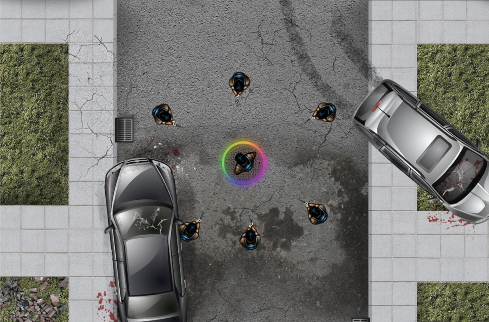

# The Crypto Purge 💸
The most revolutionary crypto shooter-survival real-time NFT-based game on **Binance Smart Chain**.

<p align="center">
  <a href="https://bio.link/thecryptopurge" target="blank"></a>
</p>

> The system controls the prize pool redistribution between winners of each game. The game runs on **WebGL** with a real-time connection using WebSockets and a Server side shooting authority connected to web3.js API to send transactions to smart contracts and back.

## Inspiration
`The Crypto Purge` is a crypto shooter-survival real-time NFT-based game inspired by [The Purge (an American dystopian action horror film)](https://en.wikipedia.org/wiki/The_Purge).

## What it does
Players will have multiple modes to play the game, `single` and `multiplayer`. **Single mode** includes killing zombies and social ranking with friends for earn prizes, the top scorers on the `leaderboard` will split the prize pool grant. 
**Multiplayer mode** allows players to contribute a certain amount of tokens to the prize pool before each game and the prize pool is split by `Smart Contracts` and a `Server Side authority` between the **winners** of the game.

`The Crypto Purge` has a crypto integrated backend that runs on **Binance Smart Chain**. **Smart contracts** are responsible for prize pool redistribution and **web3.js (Metamask, etc)** takes care of the wallet connection.

The game allow users to mint custom skins with **NFTs** to be used in the game (**Chainlink VRF** and Oracles to assign provably rare traits). Player will differ in appearance and style, but they will have no effect on the game mode.
All players will have an equal change of winning the game.

## Challenges we ran into
Creating a **decentralized real-time** game that requires a back-end connection using `WebSockets` is the most challenging part of the project, additionally because **"don’t trust the player. Always assume the worst – that players will try to cheat"**, so it requires an `authority server` to create a **cheat-proof** architecture as cheating players tends to drive the players away from the game, therefore the core problems are `human nature` and `physics`.

Developing an `authoritative server architecture` introduce a whole new class of challenges; `Client-Side Prediction`, `Server Reconciliation`, `Entity Interpolation`, `Lag Compensation` dealing with networks and scaling the system itself.

## Accomplishments that we're proud of
We're proud to have created the real-time connection of the game, creating the smart contracts of the platform and the base architecture of the project; **front-end**, **back-end** and the smart contracts development using **Hardhat**.

## What we learned
We learned about `Blockchain`, `Smart Contracts`, `Chainlink Oracles`, `2D Games` with `WebGL/Canvas` using Frameworks like `PhaserJS`, `NFTs`, `Physics`, `Real-time` connections with `WebSockets`, `Crypto wallets` and much more!

## What's next for The Crypto Purge

- Define a `System Design` for Cloud platforms like **AWS** that can scale easily.
- Apply to **Y Combinator** to get funding.
- Migrate the back-end to use a microservices architecture and use a language like **Go** with better benchmarks in terms of scalability as required by the system.
- Allow users to have an inventory.
- Allow users to take inventory of dead users.
- Allow players to edit their profile.
- Allow players to select their gender (female, male).
- Allow players to mint weapons.
- Open Marketplace to buy or mint their own skins.
- Ranking for rounds.
- Support Internationalization and localization (i18n).

## Intructions to run the projects
- **FrontEnd:**
```
cd app
yarn start
```
- **BackEnd:**
```
cd server
yarn start
```
- **Smart Contracts:**
```
cd smartcontracts
yarn start
yarn start:portal
yarn test
yarn deploy
yarn deploy:portal
```

## Contributing ✨
When contributing to this repository, please first discuss the change you wish to make via issue, email, or any other method with the owners of this repository before making a change.  
Contributions are what make the open-source community such an amazing place to learn, inspire, and create. Any contributions you make are **greatly appreciated** ❤️.  
You can learn more about how you can contribute to this project in the [contribution guide](CONTRIBUTING.md).

## Supporting 🍻
I believe in Unicorns 🦄
Support [me](https://www.paypal.me/jdnichollsc/2), if you do too.

Donate **ETHER**, **ADA**, **BNB**, **USDT**, **PING**:


> Wallet address: 0x3F9fA8021B43ACe578C2352861Cf335449F33427

Please let us know your contributions! 🙏

## License ⚖️
This repository is available under the [MIT License](https://github.com/proyecto26/ion-phaser-ce/blob/develop/LICENSE).

## Happy coding 💯
Made with ❤️


